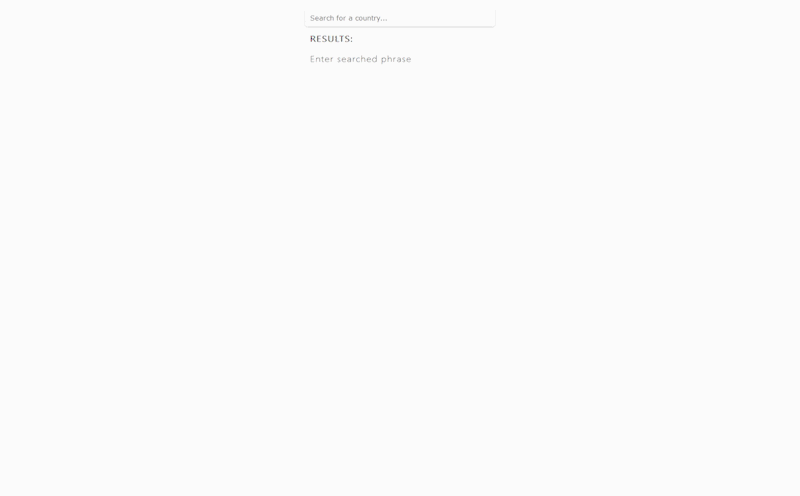

# Countries search app

## About The Project

A simple search engine built with React and restcountries.eu API.
Project built on functional components and hooks, managing state with useContext.
User can search data about any country input in search field. 
Searched records are sorted alphabetically. 
When records exceed 20, user can use pagination buttons to load next records.
When clicking on any country name, user is redirected to its subpage with base data and with possibility to load more data.
Routes implemented with React router, including seamlessly moving between pages. 
Styling made with simple CSS.

#### Features

* Collecting country names based on searched input data
* Loading base information on chosen country (name, currency and capital) on its subpage
* Dynamic pagination depending on found records
* Responsive design

### Built With

* Main technology - [React](https://reactjs.org/), state managed with hooks
* Consuming countries data from [API](https://restcountries.eu/)
* Styling made using simple CSS

## Getting Started

This project was bootstrapped with [Create React App](https://github.com/facebook/create-react-app).

### Available Scripts

To get a local copy up and runningTo get a local copy up and running, in the project directory, you can run:

#### `npm start`

Runs the app in the development mode. 
Open [http://localhost:3000](http://localhost:3000) to view it in the browser.

The page will reload if you make edits. 
You will also see any lint errors in the console.

### Learn More

You can learn more in the [Create React App documentation](https://facebook.github.io/create-react-app/docs/getting-started).

To learn React, check out the [React documentation](https://reactjs.org/).
